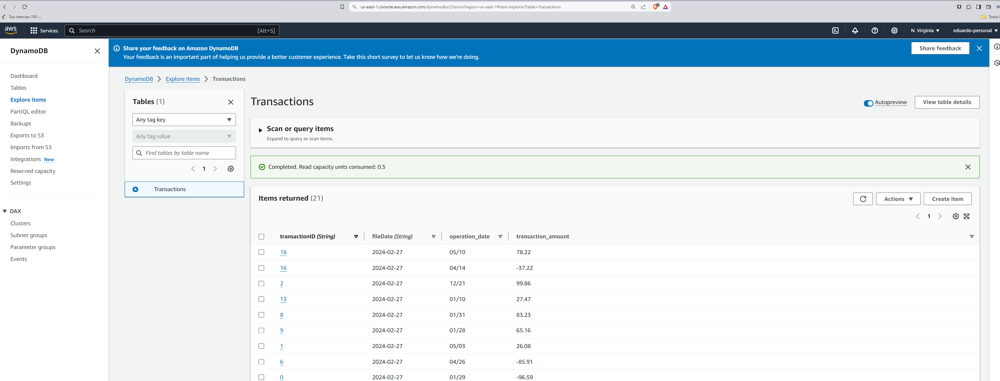

# Welcome to StoriTest!

  

Hi!

  

# Requirements

  

You will need to have [Docker](https://www.docker.com/), [AWS SAM](https://docs.aws.amazon.com/serverless-application-model/latest/developerguide/what-is-sam.html) and [Make](https://en.wikipedia.org/wiki/Make_(software)) to run this code locally.

This last one (make) is not mandatory but it will make your life simpler.

  
  

## How to start

```sh

git  clone  git@github.com:eduherrer8/stori-test.git

cd  stori-test

make  setup

make  start

```

  

## How to run

  

```sh

curl  --request  POST  \

--url http://127.0.0.1:3000/utils/transactions \

--header  'Content-Type: application/json'  \

--data  '{}'

```

  

## Results

I decide to use AWS-SAM to make sure that it was the same to build and run this stack locally and in AWS.

  

There are two ways to visualize the results. The first method is to check the response from the previous curl request, you'll see something like this

```json

{

"data": [

{

"transaction_id": "0",

"operation_date": "01/29",

"transaction_amount": "-96.59"

},

{

"transaction_id": "1",

"operation_date": "05/03",

"transaction_amount": "26.08"

},

],

"summary": {

"total": "-70.51",

"credit": "26.08",

"debit": "-96.59",

"months": {

"1": 1,

"5": 1,

}

}

}

```

I chose to use DynamoDB to store the results.

You can look at these results!!!

To see the results in the database check this URL [dynamo admin](http://localhost:8001/tables/Transactions), this is what you should visualize.


  

Since we don't have a SMTP server locally you can see the result html in the standard output of the console. You should look something like this.


  
  
  

## Transactions files

The example file is located in `src/transactions/txns.csv`, feel free to modify this file and execute as many times as you want. Don't forget to update the docker image, since this file is shared during the construction of the image.

Tip: Stop the previous make start, and run again `make start`.

## Results AWS
Here are some screenshot at the aws console.

First the lambdas


The API gateway to access them.


The results stored in DynamoDB.


The output for the mail.


